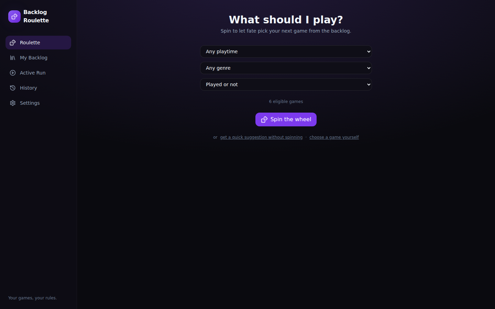
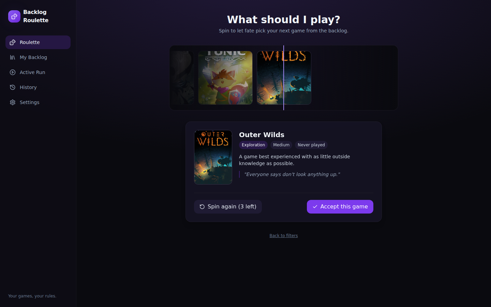
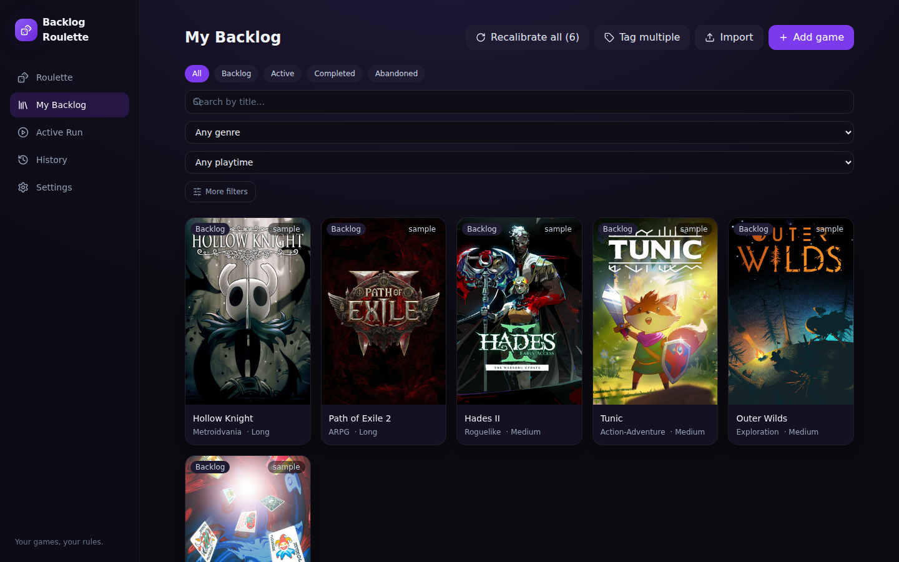
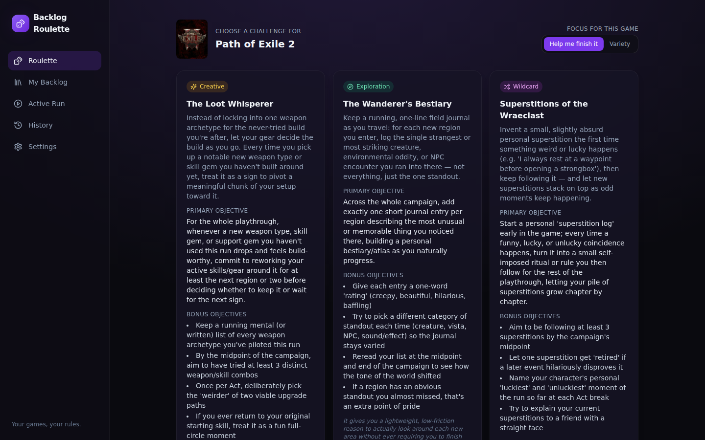
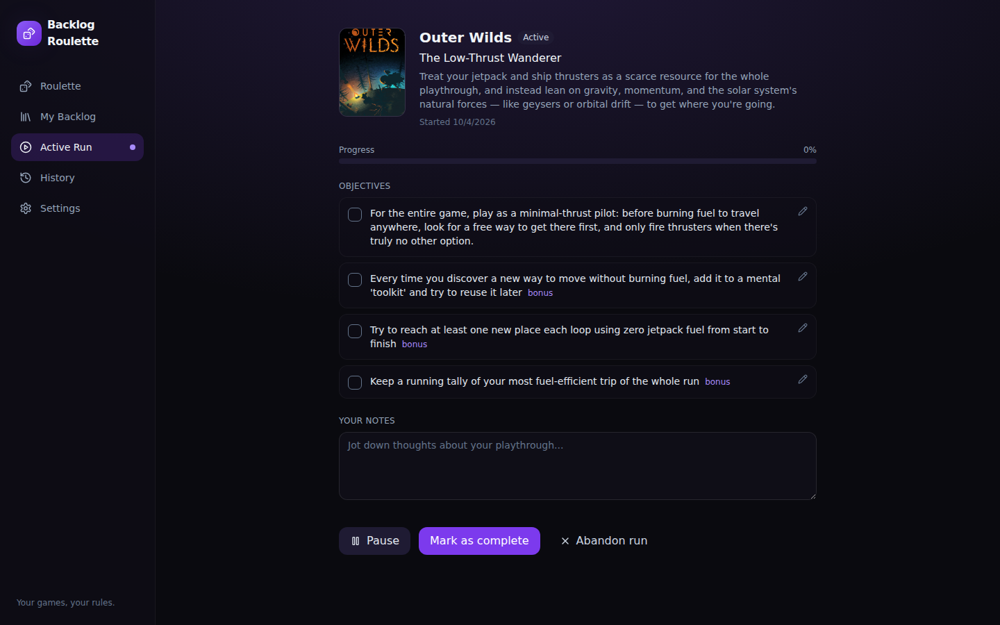

# Backlog Roulette

A locally-run app that helps you pick a game from your backlog and gives you a creative,
spoiler-free challenge to make it interesting. Dark, gaming-launcher-inspired UI, no accounts,
no cloud — everything lives in your browser's local storage.

## Screenshots

| Roulette | Reveal |
|---|---|
|  |  |

| My Backlog |
|---|
|  |

| AI-generated challenges | Active Run |
|---|---|
|  |  |

## Features

- **Roulette** — spin an animated reel to pick a random eligible game from your backlog, with
  optional filters (playtime, genre, tag, played/unplayed) and a configurable number of rerolls.
- **My Backlog** — add, edit, delete, search and filter games. Tag games freely (e.g. "Just
  bought") to carve out a subset to roll through separately from your whole backlog. Import from a
  CSV or Steam-style JSON export, or sync your whole Steam library directly, with a preview and
  duplicate detection before anything is added.
- **AI Challenge Generator** — once you accept a game, Claude generates three distinct,
  spoiler-free challenges (Creative / Exploration / Wildcard), each with a primary objective,
  bonus objectives, and a reason it might be fun. Edit, regenerate, or pick "Surprise me." A
  **Challenge focus** setting (Settings → Challenge focus) controls whether challenges for long
  story-driven games are framed as ongoing, whole-playthrough engagement structures (for players
  who tend to drop long single-player games) or as quick standalone objectives — see below.
- **Active Run** — track objectives, jot notes, pause/resume, abandon, or complete the run with
  a rating and reflection.
- **History** — revisit past runs; reset a completed/abandoned game back to Backlog any time.
- **Fully usable without AI** — if the Claude CLI isn't installed or authenticated, the app gives
  you a ready-to-copy prompt and a box to paste the response back into, or you can just write your
  own challenge by hand.

## Prerequisites

- **Node.js 18+** (tested on Node 24) and npm.
- **Optional, for AI challenge generation:** [Claude Code](https://claude.com/claude-code)
  installed and authenticated (`claude` on your `PATH`, logged in via `claude login` or your
  existing subscription/API auth). Everything else in the app works without it.

## Installation

```bash
npm install
```

## Running locally

This app has two local processes: the Vite dev server (frontend) and a small Express backend
(used to safely invoke the Claude CLI and to call the Steam Web API). One command starts both:

```bash
npm run dev
```

- Frontend: http://localhost:5173
- Backend (Claude CLI bridge): http://localhost:5174 — the frontend proxies `/api/*` to it, so you
  only ever need to open the frontend URL.

To build a production bundle: `npm run build` (output in `dist/`), then `npm run preview` to serve
it. Note the backend (`node server/index.js`) must be running separately for AI generation to work
outside of `npm run dev`.

## Importing your backlog

Go to **My Backlog → Import**, then drop in either:

- **CSV** with a `Title` column (optionally `Genre`, `Hours`, or `Playtime (minutes)`).
- **JSON** — either a plain array of `{ "title": ..., "genre": ..., "estimatedHours": ... }`
  objects, or a Steam Web API–style export (`{ "response": { "games": [{ "name": ...,
  "playtime_forever": ... }] } }`).

You'll see a preview of every row before anything is imported. Titles that already match a game
in your backlog are detected as duplicates and unchecked by default — you can still include them
if you want.

### Syncing your whole Steam library (dynamic, re-runnable)

Instead of a one-off file, **My Backlog → Import → Sync from Steam** pulls your entire owned-games
library directly from Steam's official Web API — title, playtime, and cover art — and feeds it
into the same preview/dedupe screen. You only need to set this up once:

1. Get a free Steam Web API key at **steamcommunity.com/dev/apikey** (sign in, any domain name
   works, e.g. `localhost`).
2. Find your **SteamID64** (a 17-digit number) or just use your custom profile URL name — if your
   profile is `steamcommunity.com/id/yourname`, enter `yourname`.
3. Your Steam privacy setting for **"Game details"** must be **Public** — Steam enforces this even
   when you're querying your own account with your own key.
4. Paste both into the Sync from Steam tab and hit **Sync library**.

The key and ID are saved locally (in the same browser `localStorage` as everything else) so future
syncs are one click. Since it pulls your *entire* library every time, re-running it after buying
new games is exactly how you keep it "synced" — already-imported titles are automatically skipped,
so it's safe to re-run as often as you like. This doesn't know about Steam's local category tags
(like a "Backlog" collection) since those aren't exposed by Steam's public API — everything comes
in as `backlog` status. Use **tags** (below) to recreate that kind of grouping inside the app.

## Tags — rolling the Roulette through a subset of your backlog

Every game can have free-form tags (My Backlog → Add/Edit game → Tags, comma-separated — e.g.
`Just bought`, `Co-op`, `Short & sweet`). Once at least one game has a tag, both the Roulette
filter panel and the Backlog filter bar get a matching "tag" dropdown, so you can spin only through,
say, the games you bought this month instead of your whole backlog. A game can have multiple tags;
the filter is "any game with this tag," not an exclusive category.

## Challenge focus — tuning what kind of challenges you get

Settings → **Challenge focus** has two modes:

- **Help me finish long games** (default) — for games that look like long, story-driven
  single-player experiences (RPG/open-world/narrative genres, or a long estimated playtime, and
  *not* a roguelike/arcade/puzzle/card/short-loop game), all three challenges are framed as an
  ongoing approach for the whole playthrough — a roleplay code applied throughout, a pacing ritual
  tied to story chapters, a recurring per-session habit — instead of a single one-off task. The
  goal is to give you a reason to keep opening the game, not just one thing to do once. Short or
  replayable games (Hades, roguelikes, etc.) are unaffected either way — they still get normal
  run-sized objectives, since that's what already worked well for them.
- **Variety** — always generates concise, session- or run-sized objectives regardless of game
  length, which was the original (v1) behavior.

This is a global setting, not per-game, since it's really about a mismatch between challenge style
and your own completion habits rather than any one game.

## Configuring the Claude CLI integration

The app never requires an API key — it shells out to your already-authenticated `claude` CLI.

1. Install Claude Code and make sure `claude --version` works from a normal terminal.
2. Sign in (`claude` will prompt you on first use, or run your existing login flow).
3. Start the app with `npm run dev`. Check **Settings → Claude CLI integration** — it will show
   whether the CLI was detected.
4. If it's not detected (not installed, not on `PATH`, or not authenticated), the challenge
   screen automatically falls back to a copy-paste flow: it shows you the exact prompt that would
   have been sent, you paste it into Claude (CLI or claude.ai) yourself, and paste the JSON
   response back in to continue.

Implementation notes, if you're extending this:

- `server/claudeCli.js` invokes `claude --print --output-format json` via `child_process.spawn`
  with an **argument array and `shell: false`** — the prompt is sent over stdin, never
  interpolated into a shell string, so arbitrary game titles/notes can never reach a shell.
- Requests time out after 90s; CLI-not-found, non-zero exit, and malformed JSON responses are all
  caught and surfaced as a user-facing error with the manual fallback.
- `server/promptBuilder.js` is the single source of truth for the prompt text, used both for the
  real CLI call and for the "copy this prompt" fallback, so they never drift apart.

## How your data is stored and backed up

Everything — your backlog, active/past runs, and settings — lives in your browser's
`localStorage` under the key `backlog-roulette-data`. Nothing is sent anywhere except to your own
local backend, which only talks to your local Claude CLI and (if you use it) the official Steam
Web API directly.

- **Backup / move to another machine:** Settings → **Export all data** downloads a single JSON
  file; **Import data** on the other side restores it (this replaces current data, so export first
  if you want a safety copy).
- **Clearing browser data for this site will erase your backlog** — export regularly if that
  matters to you.
- If you set up Steam sync, your Steam Web API key and SteamID are stored in that same
  `localStorage` entry (plaintext, local-only) so repeat syncs don't ask again. They're included in
  a full data export — keep exported JSON files as private as you would your Steam API key.
- Sample games (Hollow Knight, Path of Exile 2, Hades II, etc.) ship pre-loaded so the app isn't
  empty on first run. They're tagged `isSample` and removable in one click from Settings → Data.

## Project structure

```
src/
  components/      UI, organized by view (roulette, backlog, challenge, activerun, history, settings, layout, common)
  store/           Zustand store (single source of truth, persisted to localStorage)
  lib/              roulette selection, import/export parsing, API client
  data/sampleGames.ts   seed data, flagged isSample
server/
  index.js          Express server: /api/claude/status, /api/challenges/{prompt,generate}, /api/steam/sync
  steamApi.js        Steam Web API client (owned games + vanity URL resolution)
  claudeCli.js       safe CLI invocation + response parsing/validation
  promptBuilder.js   shared prompt text
```

## Known limitations

- The Claude CLI integration assumes a `claude --print --output-format json` non-interactive mode
  is available in your installed version of Claude Code; if that flag ever changes, update
  `server/claudeCli.js`.
- Challenge generation calls are not cached — regenerating always makes a fresh CLI call.
- No automated test suite is included; verification so far has been a production build, a dev-mode
  smoke test of every view, and a live end-to-end Claude CLI generation call.
